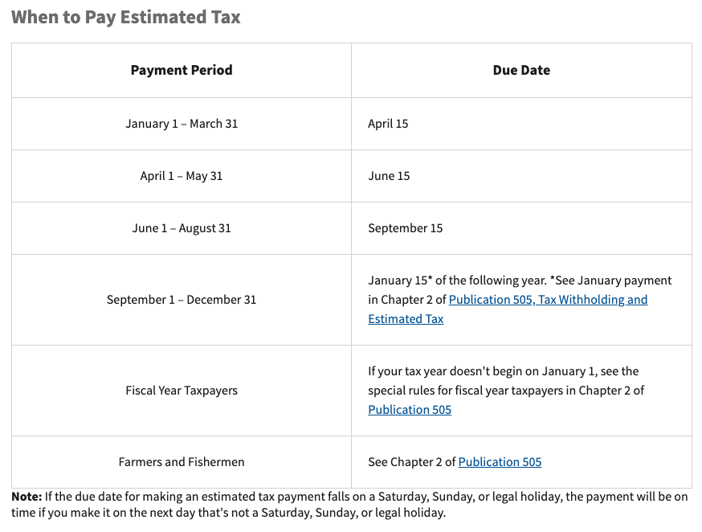

# Quarterly dOrg Tax Payments

To avoid tax penalties, dOrg must submit quarterly estimated tax payments to the IRS according to the schedule below. The accountant for dOrg will make these payments but the information for how to submit the payments are included in the handbook so the DAO is aware of the process.

Per the IRS website,

> "If you didn’t pay enough tax throughout the year, either through withholding or by making estimated tax payments, you may have to pay a penalty for underpayment of estimated tax. Generally, most taxpayers will avoid this penalty if they owe less than $1,000 in tax after subtracting their withholdings and credits, or if they paid at least 90% of the tax for the current year, or 100% of the tax shown on the return for the prior year, whichever is smaller. "

Currently, dOrg is paying 100% of the taxes owed in the prior year to meet the IRS requirements. For 2020 our tax liability was \~$1,000 so dOrg has been making estimated payments of $250 per quarter in 2021. To submit payments directly to the IRS:

1. Go to [https://www.eftps.gov/eftps/](https://www.eftps.gov/eftps/)
2. Click "Make a payment"
3. Login using the credentials below:
   1. EIN: 84-2930500
   2. Pin & Internet Password can be found in the [dOrg Log-in Credentials sheet](https://docs.google.com/spreadsheets/d/18QXB9Ski8OxHRiELfxq8DcahYFhNnEKPEM20kRjeuYA/edit#gid=0)
4. Follow the payment prompts:

Once the payment is complete, the receipt and any other associated documentation is uploaded to the [dOrg Legal and Accounting google drive](https://drive.google.com/drive/folders/1j6i0YZ\_sCy5g2zzCLJD3YfOscCpczWB3).
