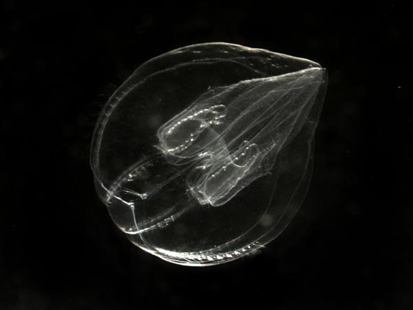

# About this Handbook

Welcome. This is a guide to how dOrg operates.

* [x] Visit the[ Website](https://dorg.tech) to learn more about dOrg services
* [x] Get in touch on [Keybase](https://keybase.io/team/dorg.membrane) or`contact@dorg.tech`
* [x] Attend the next [Open House](https://www.eventbrite.com/e/dorg-open-house-tickets-111892770288)

## License & Attribution

This work is licensed under [Creative Commons Attribution-ShareAlike](https://creativecommons.org/licenses/by-sa/4.0/) and heavily inspired by [Greaterthan](https://handbook.greaterthan.works/) and [Crisp DNA](https://dna.crisp.se/docs/index.html)[.](https://creativecommons.org/licenses/by-sa/4.0/) Image credits: [1](https://oceanexplorer.noaa.gov/explorations/02arctic/logs/mis_sum_pelagic/media/bolinopsis.html), [2](https://www.nature.com/articles/nphys2448), [3](https://www.greenbiz.com/sites/default/files/styles/panopoly_image_full/public/images/articles/featured/banyantree_jeep2499_sstock.jpg?itok=qaMOVWA1).


Although we try to keep the handbook up to date, some concepts may have changed. 


