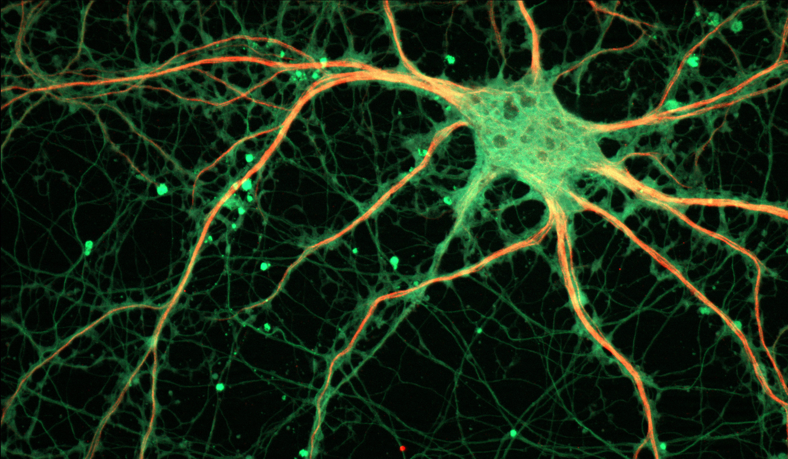

# Synchronization

Synchronized communication flows allow dOrg's constituent parts to operate in unison.

### Chats

* [Open channels](https://keybase.io/team/dorg.membrane) to discuss any aspects of dOrg or web3.
* Internal channels for coordinating work.

### Meetings

* **Quarterly Gathering.** Open call to evaluate the state of web3 and plan for the future.
* **Biweekly Sync.** Internal call for sharing cross-project updates, problems, and ideas.

### Spaces

* **Keybase**. Chat.
* **GitHub**. Code, tasks, static files.
* **Airtable**. Forms, notes, bookkeeping.
* **Zoho**. Email, calendar.
* **DAOstack**. Wallet, governance.

