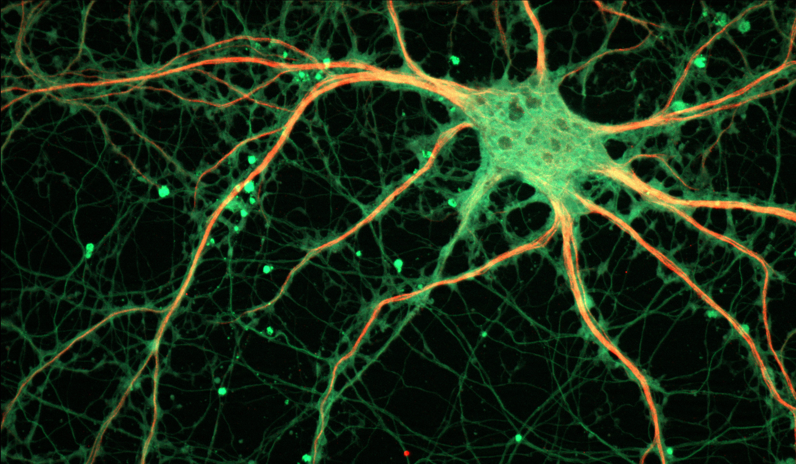

# Synchronization

Synchronized communication flows allow dOrg's constituent parts to operate in unison.

### Chats

* [Open channel](https://keybase.io/team/dorg.membrane) focused on web3 engineering, design and law.
* Members and pollinators coordinate work in closed channels.

### Meetings

* **Quarterly Gathering.** Open call to evaluate the state of web3 and plan for the future.
* **Biweekly Sync.** Members share cross-project updates, problems, and ideas.

### Resources

* **GitHub**. Code, tasks, static files.
* **Zoho**. Email, calendar, working docs.
* **DAOstack**. Wallet, governance.

