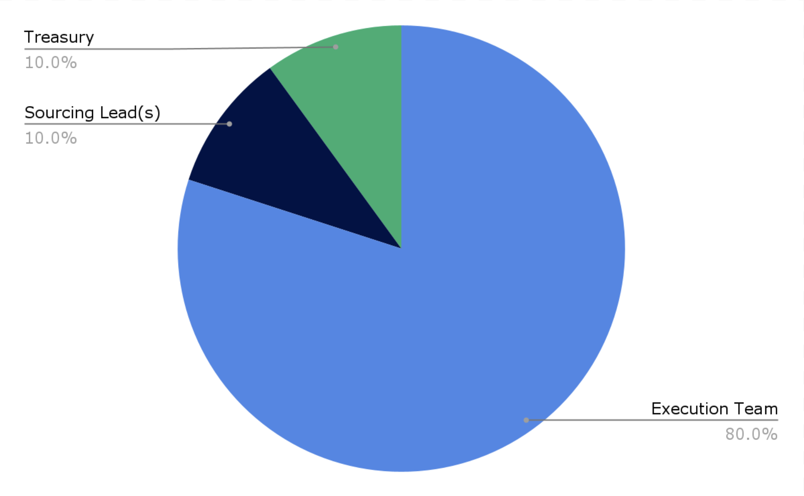

# Governance

### Flow of Funds 💸

dOrg builders work in small teams to execute on client projects. Projects distribute their income amongst the execution team, sourcing lead, and dOrg's treasury.

### Treasury 🏦

The treasury funds _ongoing roles_ (e.g. facilitator, marketing lead, sales ops lead), _internal initiatives_ (working groups, website maintenance, new ventures), and _shared expenses_ (SaaS, legal, accounting).

### Reputation 🏅

Builders receive one unit of [Rep](https://etherscan.io/token/0x62300cec5240e5b273781ad67ce735107f3dacd4#balances) for every dollar earned from dOrg projects. Rep units are non-transferable and represent a share of _voting power_ and _token bonuses_.&#x20;

### Voting 🗳

Rep enables builders to govern the treasury, builder activations, client projects approvals, Rep issuance and more through [Snapshot](https://snapshot.org/#/dorg.eth) proposals ([see more details here](workflows/navigating.md#snapshot)).

### Bonuses 🤑

Rep also grants builders a proportional share of token bonuses from client projects. Currently we flush on tokens (other than ETH and stablecoins) from the treasury to eligible builders in proportion to the square root of their rep-holdings at the end of each quarter.

### DXRG (deprecated)

[DXRG Tokens](https://blockscout.com/poa/xdai/tokens/0x76D37cbB1fD75912bfB0cE885c506C77955F5C05/token-transfers) were previously used track unpaid obligations ([see redemption instructions here](https://forum.dorg.tech/t/deprecating-dxrg-debt-tokens/209)).

### Governance model&#x20;

