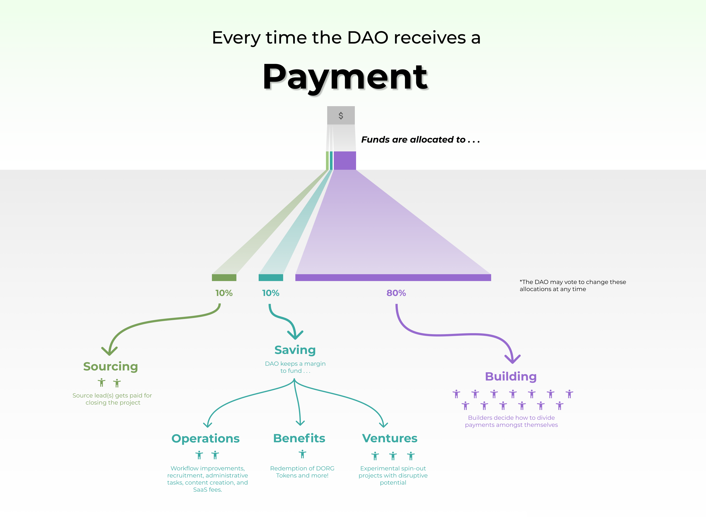

# Governance

### Value Flow

Each project team receives payments directly from the client to a Gnosis Safe that it controls. The team distributes these funds to its builders \(80%\), sourcing lead \(10%\), and dOrg's shared treasury \(10%\).

### Reputation

Builders receive 1 dOrg [rep token](https://etherscan.io/token/0x62300cec5240e5b273781ad67ce735107f3dacd4#balances) for every dollar earned from dOrg projects. Rep tokens represent a share of _voting power_ and _future airdrops_.

Rep is non-transferable, and hence associated with a specific wallet address. Make sure to consistently use the same wallet address across all dOrg projects so that your reputation accumulates in the same wallet.

### Voting

Anyone with reputation can create and vote on proposals in [Snapshot](https://snapshot.org/#/dorg.eth). Proposals are used to approve new builders, client projects, budgeting decisions and more.

### Airdrops \(coming soon\)

Reputation also grants builders a share of dOrg's token airdrops. More on this soon!

### DXRG Tokens \(deprecated\)

[DXRG Tokens](https://blockscout.com/poa/xdai/tokens/0x76D37cbB1fD75912bfB0cE885c506C77955F5C05/token-transfers) were previously used track **unpaid obligations**. Holders may burn their DXRG \(send to 0 address\) for $1 each.

