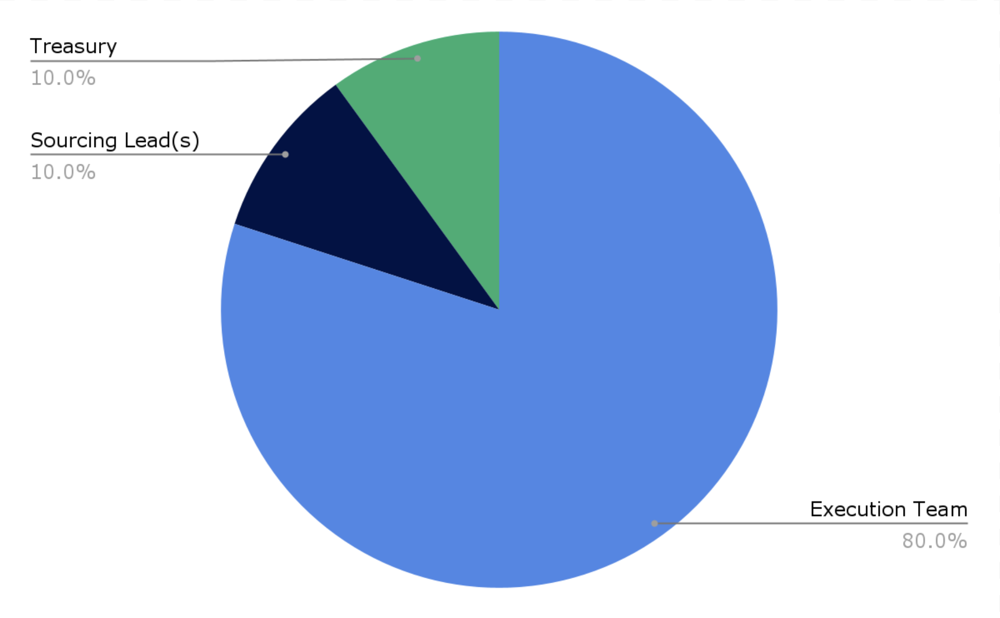

# Governance

### Flow of Funds

dOrg builders work in small teams to execute on client projects. Projects distribute their income amongst the execution team, sourcing lead, and dOrg's treasury.

### Treasury

The [treasury](https://gnosis-safe.io/app/#/safes/0xdb22d2d37db92EA7fa6993C9f6Ead55FBb1eF4EA) funds _ongoing roles_ \(e.g. facilitator, marketing lead, sales ops lead\), _internal initiatives_ \(working groups, website maintenance, new ventures\), and _shared expenses_ \(SaaS, legal, accounting\).

### Reputation

Builders receive one [Rep token](https://etherscan.io/token/0x62300cec5240e5b273781ad67ce735107f3dacd4#balances) for every dollar earned from dOrg projects. Rep tokens are non-transferable and represent a share of _voting power_ and _airdrops_. 

### Voting

Rep enables builders to govern the treasury, builder activations, client projects approvals, Rep issuance and more through [Snapshot](https://snapshot.org/#/dorg.eth) proposals.

### Airdrops

Rep also grants builders a proportional share of token airdrops from client projects. More on this soon!

### DXRG \(deprecated\)

[DXRG Tokens](https://blockscout.com/poa/xdai/tokens/0x76D37cbB1fD75912bfB0cE885c506C77955F5C05/token-transfers) were previously used track unpaid obligations. Each DXRG can be redeemed for one dollar.

