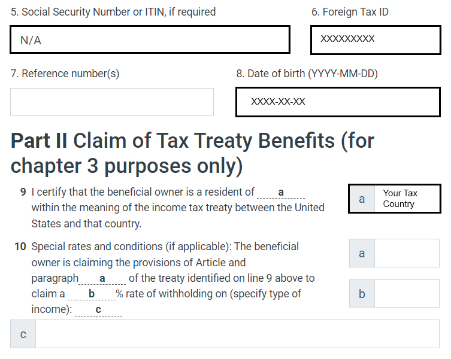

# Onboarding

Shortly after your activation proposal passes, you'll get a dOrg email account and Discord access.

Our Experience Facilitator will then send you details of your new email account and a link to an onboarding form that lets you consent to our member agreements and walks you through the key information and points of reference so that you can confidently join the community from the start.

You'll also would be able to schedule an orientation-focused call to walk through any areas of dOrg you'd like more information on and explore which projects might be the best fit to start.


Make sure you have everything you need to be part of dOrg&#x20;

✔️ dOrg **email** activated\
✔️ dOrg **calendar** integrated to your primary calendar \
✔️ dOrg **forum** profile created (using your dOrg email)\
✔️ dOrg **Discord** private channels access \
✔️ dOrg **Github** member\
✔️ **Tax form** submitted (W-9 for US or W-8BEN for non-US) + Upload it on GDrive folder 'dOrg\_Personnel Folders'\
✔️ Sign **Contractor Agreement** + Upload it on GDrive folder 'dOrg\_Personnel Folders'\
✔️ **Onboarding form** submitted (including consent to member agreements) \
✔️ **Onboarding call** scheduled


### Integrating your Calendar

It's important for working on teams to have your dOrg email address calendar connected with your primary calendar. If you use a different email address as your primary calendar, you can connect your dOrg calendar by:

1. Log in to your dOrg gmail and go to your calendar
2. Go to calendar settings and under "Share With Specific People" add your main email address. Set the permissions to "Make changes and manage sharing"
3. Go to your main email address inbox and click the emailed link to add the calendar to your list. You should now see your dOrg email calendar events showing in your main calendar

### Filling your W-8BEN form

For non US Tax Residents W-8BEN is the way to go. Here's some help:&#x20;

### Filling your W-9 form

US Tax Residents W-9, here's some help to fill the form:&#x20;


### Admin Steps for Onboarding a new Member

Here are the instructions for the Experience Facilitator and others to help onboard new members once their membership proposal has passed on Snapshot:

1. **Give them the 'dOrg Member' tag on** **Discord** (you should be able to find their handle in the corresponding forum post), along with relevant skills such as 'frontend' or 'product'.&#x20;
2. **Create a @dorg.tech email address in** [**google admin**](https://admin.google.com) **** using their first name (or first plus last if its already taken). Click Add New User, enter info (include their personal email address as the secondary email), click preview and send.
3. **Add their dOrg email address to the 'All Members' Google Group**. (This triggers a Google invite to the All-Hands meetings and gives access to all shared documents.)
4. **Send out a W-9 form (if they're US-based) or a W-8BEN tax form (if they're not US-based) to their personal email address.** (contact dOrg's accountant for details on how to do this).
5. **Create & Share Personnel Folder 'dOrg\_Personnel Folders**' with Contractor Agreement + Statement of work to be signed&#x20;
6. **Send the welcome email** ([find the template here](https://forum.dorg.tech/t/new-builder-onboarding-email-template/242)), which includes a link to the interactive onboarding form. At the end of the onboarding form they have the opportunity to book an onboarding-specific call with our Experience Facilitator.
7. **Check the** [**Onboarding & Experience Facilitator records sheet**](https://docs.google.com/spreadsheets/d/1dJEASJk7orOm50cb8Nnye-X3DsVUHVdt2xJ0T45R0nw/edit?usp=sharing) for form responses.
8. **Introduce new member in Discord in** `general-internal`
9. **Add as member on** [**dOrg's Github**](https://github.com/dOrgTech) ****&#x20;


