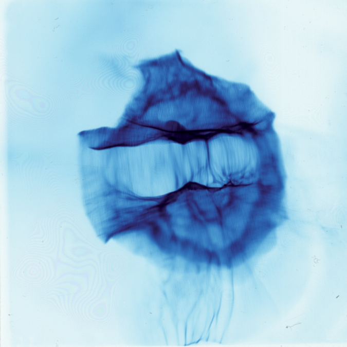

# Form & Function

### dOrg exists as a reputation-weighted DAO with legal personality.

Since then some basic metabolic processes have emerged.

### Activation & Onboarding

New builders are continually [activated](../lifecycle/activation.md) and [onboarded](../lifecycle/onboarding.md) into the DAO. Builders [deactivate](../lifecycle/deactivation.md) after 90 days of inactivity in the community but can always reactivate.

### Core Workflows

The core activity at dOrg is [building for our portfolio of Web3 clients](../workflows/joining-1.md). We also have builders that specialize in [sourcing](../workflows/sourcing.md), [managing](../workflows/project-manager.md), and [leading](../workflows/qa-lead.md) projects.

### Governance

The margin on paid projects grows the DAO's [savings](../governance/savings-payments.md), which builders control through [reputation](../governance/rep-and-tokens.md) accumulated over time. Builders also govern all organization-wide decisions.

