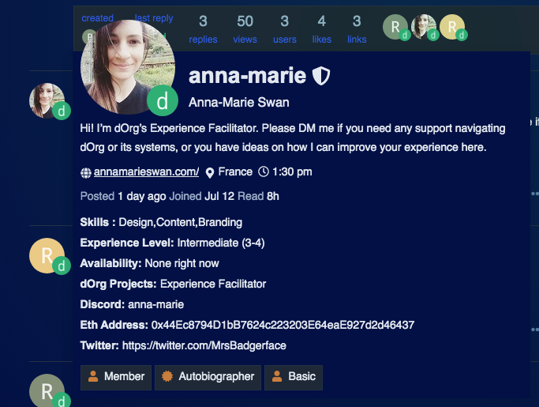

# Navigating our channels

## Forum

The dOrg forum hosts our discussions and proposals about governance, internal projects, activating new builders, and new ideas about systems and builder support. It is also where you look to find client projects to work on, and share your availability. 

There is a Docs & Key Info thread that you will likely find useful as you start building. If a proposal needs the dOrg community to vote on it, we'll create that proposal in [Snapshot](https://snapshot.org/#/dorg.eth) and add a link to the relevant forum post.

Watch the below video to run through our main forum categories.




During sign-up to the forum, you'll be asked to add a profile picture. Please upload a professional headshot. This profile picture will be added to our builder section on the dOrg website so please make this a high-resolution profile shot with an un-busy background and in square ratio. You're welcome to add a friendly and well-designed avatar if you'd prefer.


The dOrg forum is also where builders set up their profiles. This includes:

* Your skills.
* The general experience level of your skills.
* A Github link, personal profile site, or LinkedIn link.
* Technologies you are proficient in \(including technical skills like programming languages, or design tools like InDesign, or project management tools like Trello\).
* Your availability \(including how many hrs a week you're available and if those hours are only at certain times of the day\).
* Your Discord handle.
* The Eth address you'd like used for payments. This should be a self-custodied wallet like Metamask or Ledger or similar.
* \(If you choose to add it\) your Twitter link.  
  
  **You view someone's profile by clicking on their profile image in Discourse.**

  
  Here's what our Experience Facilitator's profile looks like:


**Profiles are set up when joining the forum for the first time.** However, our project managers and tech leads will use the details in your profile to search for their talent needs, so please make sure you keep your profile updated.


## Snapshot

Once proposals have gone through a dialogue process in the forum, they are posted to Snapshot for a formal vote by the DAO. Your voting weight corresponds to your [rep score](../governance/rep-and-tokens.md#reputation). 

## Discord

Discord is where day-to-day chat on internal projects and client projects happens. It's also where [sourcing leads](https://docs.dorg.tech/workflows/sourcing) review incoming client project requests, where you will find a running list of snapshot proposals, and where you can ask for help from peers if you are stumped on an issue or would like feedback.


If you've never used Discord before, [watch this beginner's guide](https://www.youtube.com/watch?v=rnYGrq95ezA&ab_channel=Howfinity).

Then [use this link to join the dOrg server](https://discord.gg/6X8bedvKkQ) and access our public channels.

Click on the down arrow next to 'dorg' at the top of the screen and add a Discord nickname.


 

