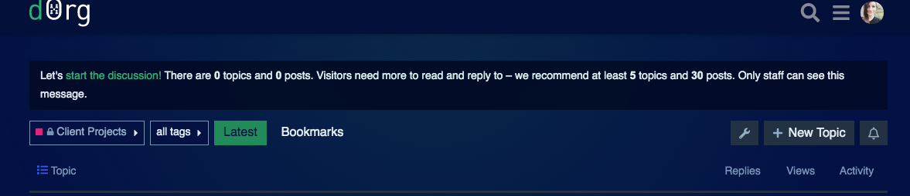

# Talent matching

Sourcing Leads, Project Managers and Tech Leads can find a builder to match your project needs by:

1. Searching in the [forum](https://forum.dorg.tech/) using the search bar. You can search by technologies \(react, ethers.js,..\), skill area \(frontend, smart contracts, web3 integrations,..\), the name of a past dOrg project, experience levels, and more!
2. Posting details about the client project and your talent needs on the forum's [Job Board](https://forum.dorg.tech/c/job-board/9).
3. Adding your need to your particular [client project](https://forum.dorg.tech/c/clientproject) thread.

