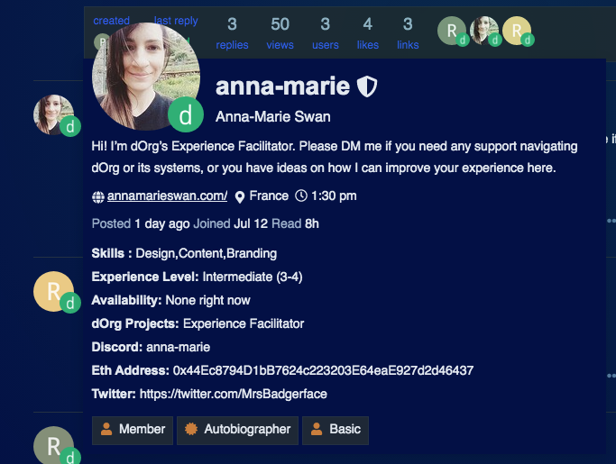

# Navigating our channels

## Forum

The dOrg forum hosts discussions about talent needs, new builders, client projects, internal initiatives, and diff governance topics. When a decision needs to be made, anyone can post a proposal to Snapshot \(see below\) that links to the relevant forum post.

Watch the below video to run through our main forum categories.



The forum is the best place to find a project to work on. Go to the [client projects section](https://forum.dorg.tech/c/clientproject) and click through to see which ones have open roles.

The forum is also a great place to find builders to join a project. Go to the [user list](https://forum.dorg.tech/u/) and click on anyone's profile image to view their profile details. You can also use the search icon at the top right to find builders by skill area \(frontend, smart contracts, design\), technology \(react, ethers.js, python\), projects worked on, experience levels, and more!


**Profiles are set up when joining the forum for the first time.** However, your peers will use the details in your profile to search for their talent needs, so please make sure you keep your profile updated.



Don't forget to upload a professional headshot or well-designed avatar to your profile. This picture will be displayed on dOrg's website, so make sure it's a high-res square image with an un-busy background.


## Snapshot

Once proposals have gone through a dialogue process in the forum, they are posted to [Snapshot](https://snapshot.org/#/dorg.eth) for a [reputation-weighted](../governance.md#reputation) vote.




Head to [Snapshot's Handbook](https://docs.snapshot.org/proposals) if you need further assistance.


## Discord

[Discord](https://discord.com/invite/6Kujmad) is where day-to-day chat on internal projects and client projects happens. It's also where you can find incoming client project requests, new snapshot proposals, and ask for help or feedback from peers.


If you've never used Discord before, [watch this beginner's guide](https://www.youtube.com/watch?v=rnYGrq95ezA&ab_channel=Howfinity).



Select a nickname that is consistent with your first name or handle in the dOrg forum to make yourself easier to find. You can set a nickname by selecting the down arrow next to 'dOrg' at the top left, and then 'Change Nickname'.


