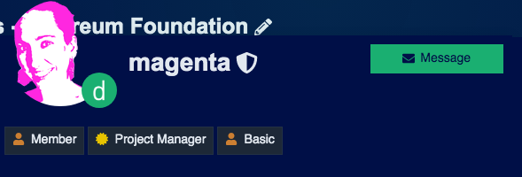
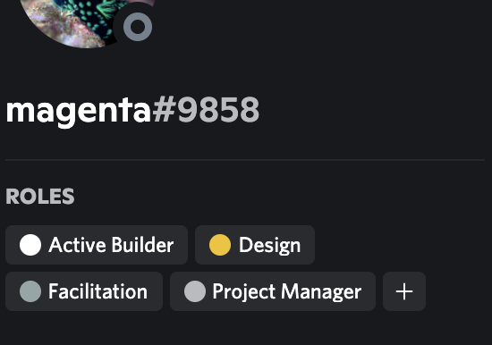

# Project Manager guide

Each project must have a builder with the `Project Manager` badge to:

* Own client communication.
* Review builder logs and process payments.
* Monitor scope load and deadlines.

On our forum, you can see if someone is a Project Manager by clicking on their profile picture.

On Discord, you'll find it when you click on a user's image.

  
The `Project Manager` badge is governed by the DAO and issued to builders who meet the following qualifications:

* Successful track record helping to coordinate dOrg projects and/or highly visible open source projects.
* Confident communicator.
* Has shadowed a `Project Manager` for at least one week on an ongoing client project.

## Project Management Workflows

As PM, you are responsible for ensuring client and builder satisfaction through quality execution and orderly payments.

### Project Setup

1. Fork the [QA Worksheet](https://docs.google.com/document/d/1NR6CZbwduSgsbRVDJFXcZBB1fXSprMeSHICob5Gfd8k/edit#heading=h.k20qb4mo4uip) and fill out the Project Details and Personnel tables.
2. Schedule a recurring weekly builder check-in \(15-30 min\) followed by a client check-in with all builders \(30-45 min\).
3. Ensure all builders are onboarded to the client’s project board and comms channels \(set up if needed\)
4. Fork the [Budget template](https://docs.google.com/spreadsheets/d/1T-tvQjN64HSipPBuR0SXS1ObdQmj-mElhVCUyeVhhek/edit#gid=0) and make it visible to the DAO by adding active-builders@dorg.tech as editors.

### Ongoing Quality Assurance

1. Remind builders to attend the weekly check-in.
2. At the builder portion of the check-in, fill out the Progress Tracker table with:
   1. Green rows: review actuals from the previous week.
   2. White rows: plans for the coming week.
   3. Discuss any issues people are experiencing \(scope creep, communication issues, etc.\)
3. At the client portion of the check-in, review and discuss each column.

### Payment Processing

1. At the close of each pay period, make sure each builder's hours and worklogs is entered.
2. The Payout tab automatically calculates the payout amount for each builder. Each builder will have a stablecoin payment \(we ask all clients to pay in DAI\), and a dOrg reputation token payout. Some projects also have bonuses in the client's native tokens — if you aren't clear on the setup, ask the Sourcing Lead.
3. Export the Payout tab to CSV and upload it to the Gnosis Safe's CSV Airdrop app. This will allow you to issue all payouts in one batched transaction. Once the transaction is created, ask the rest of the project's signers to review and sign  the transaction, and then it can be executed.


We're currently working on how to reimburse gas costs through a bulk proposal from the dOrg DAO.


## **QA Worksheet Guide**

Here is some guidance on how to use the Project Tracker in the [QA Worksheet](https://docs.google.com/document/d/1NR6CZbwduSgsbRVDJFXcZBB1fXSprMeSHICob5Gfd8k/edit#heading=h.k20qb4mo4uip).

* **Top Priorities:** What are the pieces of working software we’re going to create this week?
  * This is a way for us to ensure that we are working on the most critical things at the right time. 
* **Blockers:** client, 3rd party or internal blockers that are preventing us from making progress on top priorities:
  * Explicitly state who is responsible for clearing the blocker \(client, dOrg, specific 3rd party, etc.\) 
* **Testing:**
  * Required: Automated testing of all core functionality.
  * Required: Integration testing before major releases. 
* **DevOps:** Setup and maintain CI/CD tooling to ensure compliance with all testing suites and allow the client to see our progress in realtime:
  * Links to most recent deployment and test suite run
  * Notes on any changes to make to the DevOps setup \(hosting, DNS, etc\) 
* **Documentation:** Everything is expected to be well documented and this column is used to link the client to documentation of this week’s priorities:
  * Required as baseline for every project:
    * Documentation at the product level prior to code.
    * Documentation for different parts of the stack. 
* **Code Review:** After large components are completed, we will find an external code reviewer to review the code:
  * Note who completed the code review and include a link to the review.
  * Please see our &lt;Development Best Practices&gt; for code review guidelines: process, timing, format, reference to original specs.

## **Risk Factors**

Occasionally check-in with individual builders to see how they are feeling about the project. If you notice any of the following risk factors, immediately meet with the builders and/or client to discuss solutions:

* Junior devs and senior mentors: is this flow happening well? If not, address it with them and if it’s still problematic contact the sourcing lead.
* Product leadership: sometimes it isn’t clear if the client or the dOrg technical lead on the project is leading product. If there is confusion, ask for clarification of leadership roles.
* Client pushing too fast to get to market: Don’t cut corners on required QA baselines. The issue is that it will always be dOrg’s fault in the end. If the client is unwilling to respect our leadership on baselines, discuss stopping the engagement with the sourcing lead.
* Over-allocating: Monitor hours to make sure we are not going over what the client is paying for; consider modifying the contract to have a higher hour allocation or removing a builder from the project
* Under-allocating: Monitor hours to make sure we are not going under what the client is paying for; consider adding builders to the project or modifying the contract to have a lower hour allocation

