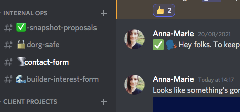
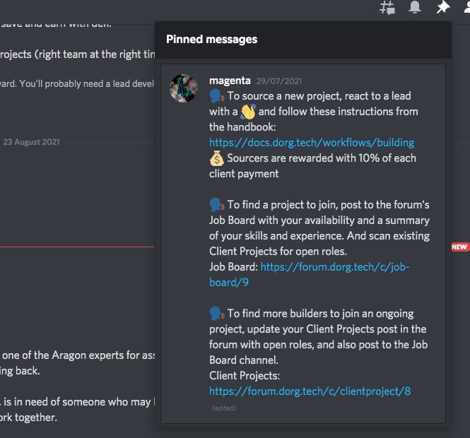

# Sourcing new client projects

Potential client projects are sourced in two ways.

1. **Personal contact** If you have a personal relationship with a potential client, head to the Client Projects category on the forum and make a new post \(guidelines [here](https://forum.dorg.tech/t/about-the-client-projects-category/19)\). You can choose to seek a Sourcing Lead or act as the Sourcing Lead yourself. 
2. **Via our Contact Form** Any potential client can complete our [Contact Form](https://www.dorg.tech/#/contact) on our website to share details of their project. To ensure that we are a meritocratic community, all contact forms are automated into our \#contact-form channel in Discord. This means that no builders get to see potential projects before anyone else. 

If you see a potential client project that you would like to be the Sourcing Lead for, add a 👋 emoji. This is how we indicate our interest \(and stops clients from receiving contact from numerous builders\).

Once you have added a 👋 to the contact form admission, click on the pinned message to find step-by-step guidelines for sourcing. You'll also find this information below.

**Any active builder is qualified to source new projects. Sourcing Leads can also fill other roles on the project like Project Manager, Tech Lead or Builder.**


Sourcing is a team sport! Remember that you can co-lead the sourcing process with others and share the rewards.


## **1. Initial Contact**

Here is an email template for responding to inbound inquiries from potential clients:

> _Hi \[Name\],_
>
> _Thanks so much for your interest in hiring our builder collective. Your submission caught our eye and we'd love to meet with you. We'll discuss your project more in depth and tell you what it’s like to work with dOrg._
>
> _🤙**Please schedule a call with me at your earliest. \[Your calendar link\]**_
>
> _In the meantime, please prepare an outline of your project’s requirements that we can review on the call._
>
> _Looking forward to meeting with you!_
>
> _Cheers,  
> \[Your Name\]_

## 2. Screening Call

The goal of the screening call is to assess the client’s fit for dOrg and help them understand what it’s like to work with dOrg. 

Here are some questions to guide your call:

* _How did you hear about dOrg?_
* _Tell me about **the project** and your needs._
* _What does **the team** currently look like?_
* _What is the **tech stack**?_
* _What **skill areas** are needed? \(smart contract, web3 integration, design, frontend, etc.\)_
* _What is your ideal **timeframe**? How flexible is this?_
* _Do you have a project requirements doc that you could send?_
* _Do you have any other questions about what it’s like to work with dOrg?_

## 3. Team Formation

The next step is to gather interested builders and schedule a technical Q&A with the client.

1. Post in [Client Projects](https://forum.dorg.tech/t/about-the-client-projects-category/19) in the dOrg forum, following the instructions on the pinned post.
2. Schedule a call with the client and all interested builders. Make sure that the builders review available materials so that they can be prepared to ask questions during the call.


In addition to a well-balanced set of builders that match the project’s needs, each team must have a [_Project Manager_](project-manager.md) and [_Tech Lead_](tech-lead.md)\_\_


## 4. SoW

If the interested builders agree that the project looks promising, does not have major technical issues or execution risks, and that they have the availability and skills to take on the engagement, then proceed with the following.

1. Create SoW on [Pandadoc](https://app.pandadoc.com/a/#/templates-next?sortBy=name&direction=asc&displayMode=folders_first&mainFilter=all). Go to Templates, hover over ‘dOrg SoW Template’, and click ‘Create Document’ \([see login credentials here](https://docs.google.com/spreadsheets/d/18QXB9Ski8OxHRiELfxq8DcahYFhNnEKPEM20kRjeuYA/edit?usp=sharing)\)
2. Update the forum post you made earlier with the draft SoW to get feedback from the interested builders on the timeframe, pricing, and scope
3. Send the SoW to the client through PandaDoc. Revise if reasonable and necessary based on the client’s feedback.
4. Once the client has signed, to submit a proposal to the DAO through [Snapshot](https://snapshot.org/#/dorg.eth) that links to the forum post **but does not name the client publicly.**

## 5. Invoicing 

1. Once the proposal passes, create a [Gnosis Safe](https://gnosis-safe.io/app/#/welcome) on mainnet with the _Sourcing Lead_, _Project Manager_, _Tech Lead_, and all other committed builders as signers. Examples of required signers: 2/3, 3/5, 4/7.
2. Invoice the client via [Gilded](https://app.gilded.finance/auth/login), making the invoice recurring unless not appropriate for this project’s cycle \([see login credentials here](https://docs.google.com/spreadsheets/d/18QXB9Ski8OxHRiELfxq8DcahYFhNnEKPEM20kRjeuYA/edit?usp=sharing)\)
   * Login &gt; Contacts &gt; Add Contact &gt; 
   * Accounts &gt; Add Account &gt; Input address &gt; Wallet Address is the project's Gnosis Safe's address
   * Payments &gt; Invoices &gt; Recurring &gt; New Recurring Invoice &gt; Set the details \([view example here](https://app.gilded.finance/invoice/view/mDNglRQ0kMtaLDxwjvms)\), and check the box to automatically email invoice to customer.
3. As soon as the client pays an invoice, issue 10% to the dOrg Safe so the DAO can issue dOrg tokens to the project Safe for the remaining 90%. Make sure that the _Project Manager_ then issues you your 10% with corresponding dOrg Tokens on the next builder payment.
4. Continue to invoice on the agreed upon schedule. Regularly monitor the project's health through the _Project Manager_ and _Tech Lead_, making sure to step in and help resolve any issues that arise.

