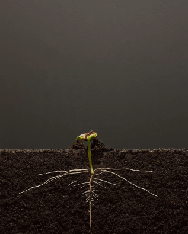

# Activation

Follow the instructions below to begin your activation journey.

### 1. Activation Challenge

Create something that **enables decentralized organizations**.

* **Mini-hack**: Explore ideas in any domain 
* Finish within **1 day.**


Check some [past submissions and additional ideas](https://github.com/dOrgTech/activation-challenge-examples) for inspiration.


### 2. Install Dependencies

Before submitting your proposal, you will need to:

1. Install a [wallet](../glossary/web3.md#wallet) like Metamask
2. [Add xDAI Network support](https://www.xdaichain.com/for-users/wallets/metamask/metamask-setup) to your wallet
3. Sign into [Alchemy](https://alchemy-xdai.herokuapp.com/) \(hit Connect in the top right corner\)
4. Acquire xDAI by requesting some in the [\#activation channel on Keybase](https://keybase.io/team/dorg.membrane) or buy it yourself from the [xDAI bridge](https://dai-bridge.poa.network/). 

### 3. Submit your Proposal

[Submit this join form](https://airtable.com/shrax93Om9NgA54yK) and then you'll be redirected to an auto-generated proposal in Alchemy.


Before submitting the proposal, make sure to add your

* [x] **Name** in the _Title_
* [x] **Link to your creation** in the _Description_
* [x] **Ethereum address** as the _Recipient_


### 4. Wait for the Votes!

Now that your proposal is submitted, dOrg agents will review and vote. Proposals are typically processed in 2 - 7 days.

If your proposal passes, you will receive **100 xDAI** + **100 Rep** and move on to [Onboarding](onboarding.md).

If the DAO rejects your proposal, don't worry – you can always try again! Currently we expect a steady growth of 1-2 agents per month.


Reach out at [contact@dorg.tech](mailto:contact@dorg.tech) or send a message in the [\#activation channel on Keybase](https://keybase.io/team/dorg.membrane) to discuss activation ideas, request some xDAI, or any additional help!


